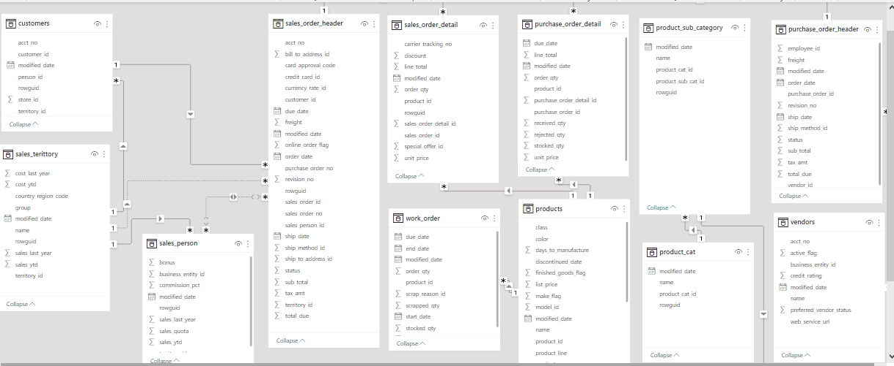
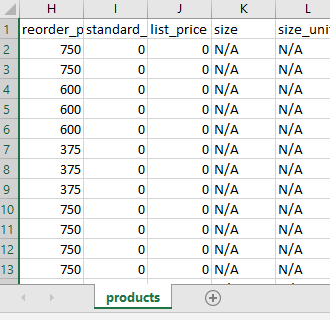
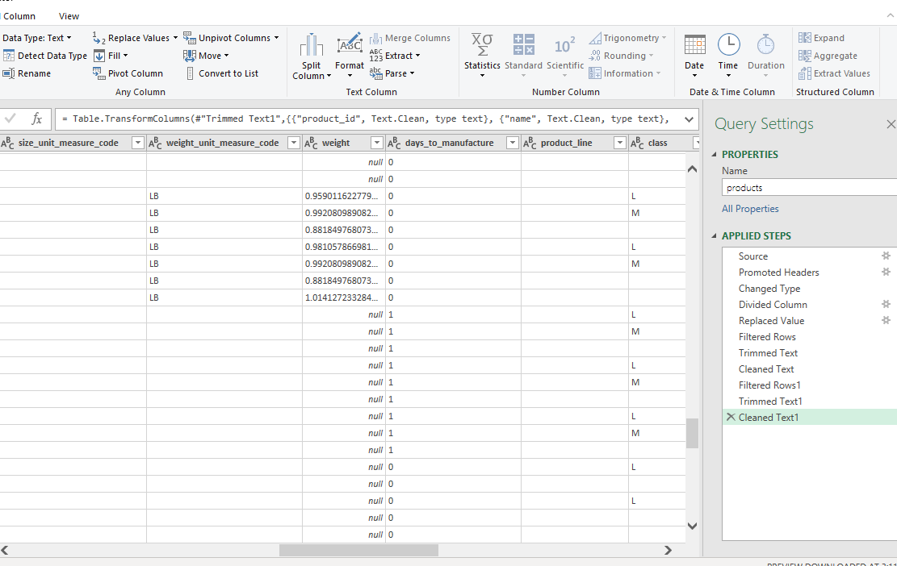
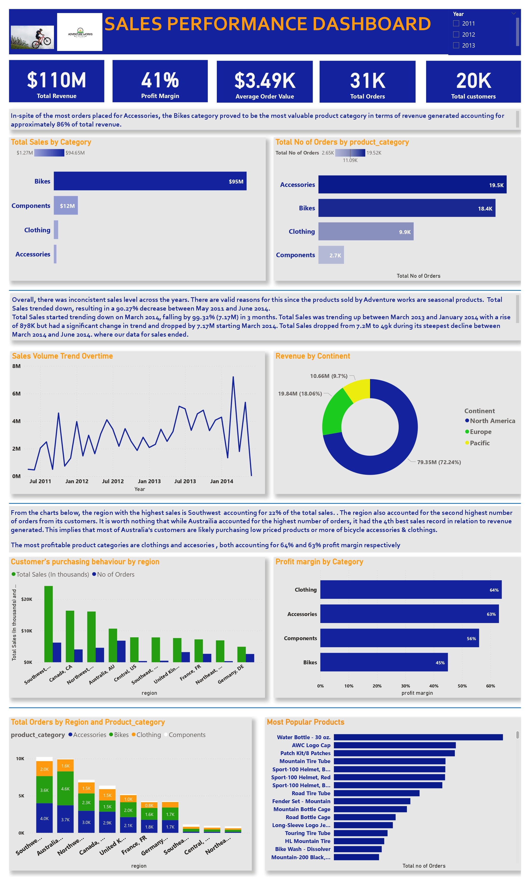

# UNLOCKING-Insights-with-the-ADVENTURE-WORKS-DATABASE

## INTRODUCTION

YES! It is long… very long, and meaty. But bear with me, because this is more than just an analysis. This is a journey back to our childhood, to the exhilarating feeling of getting on a bicycle and feeling the wind in our faces. Remember how we begged our parents to get us one, and how they told us we had to earn it by being our best selves? That feeling of accomplishment and joy is what Adventure Works, a large conglomerate that supplies bicycles to customers, is all about.

In this work, I’ll be sharing with you a robust and technical exploratory data analysis of the Adventure Works database. But it’s not just about numbers and graphs. It’s about people: from the 5-year-old who just got their first bike to the 45-year-old who still loves to ride, Adventure Works serves them all. And by analyzing their data, we can help the company improve its service performance and better serve its customers.

So let’s take a ride through Adventure Works, explore its vast data sets, and see how it all connects back to our shared love of bicycles. Because in the end, this work is about you and me, it’s about people, it’s about bicycles, and it’s about Adventure Works.

Our project aims to analyze sales and customer data from the AdventureWorks2019 database, with the sole intent of identifying trends and patterns that can inform business strategy and decision-making.

The dataset can be found here, but for this analysis, we will be working with the Sales, Production, and Vendors Departments.

## DATASET DICTIONARY

1. Sales.SalesOrderHeader: This table contains header information for sales orders, including order ID, order date, customer ID, salesperson ID, and shipping information.
2. Sales.Customer: This table contains information about customers, including customer ID, name, geographic location, demographic information, and contact information.
3. Sales.SalesPerson: This table contains information about salespeople, including salesperson ID, name, and demographic information.
4. Sales.SalesTerritory: This table contains information about sales territories, including territory ID, name, and geographic information.
5. Production.Product: This table contains information about products, including product ID, name, category, cost, and price.
6. Sales.SalesOrderDetail: This table contains detailed information about sales orders, including order ID, product ID, quantity, unit price, and discount.
7. Purchasing.PurchaseOrderHeader: This table contains header information for purchase orders, including order ID, order date, vendor ID, and shipping information.
8. Purchasing.Vendor: This table contains information about vendors, including vendor ID, name, and contact information.
9. Purchasing.PurchaseOrderDetail: This table contains detailed information about purchase orders, including order ID, product ID, quantity, unit price, and discount.
10. Production.Work Order: This table contains information about production work orders, including work order ID, product ID, start and end dates, and status.

## DATA SCHEMA

To carry out this analysis, the following tools were employed

1. PostgreSQL 2. Power Query 3. Excel 4. Power BI
   
Below is the outline of this analysis process

1. Explore Dataset and perform Data Validation
2. Data Cleaning
3. Answer Business Questions and Perform Exploratory Data Analysis
4. DASHBOARD PRESENTATION
5. Share Insights and Make recommendations
   
## PHASE 1: DATA EXPLORATION AND VALIDATION
After exploring the datasets with Excel & power query, two data quality issues were identified. The weight and weight unit measurement column of the products table had inconsistent values, as some were entered in Pounds. Others were entered in grams. There were also some null records in the product characteristics columns like size, style, and class.

## PHASE 2: DATA CLEANING
To handle null values, I replaced all nulls with N/A for the product characteristics columns. This was after confirming that this step would not impair our analysis, based on its goal. Values in grams for the weight column were converted to LB(pounds).

After confirming every quality issue was handled, We can report that the data is clean and suitable for analysis.

: 

## PHASE 3: Answer Business Questions and Perform Exploratory Data Analysis
Questions and Answers
1. What are the most popular products among customers?
   2 PICS HERE
ANSWER: From our result above, the most popular products among customers are Water Bottle, Logo Cap & Patch kits

2. Which geographic regions generate the most sales?
   A OIC HERE
ANSWER: At $24.18M, Southwest, US had the highest Total Sales and was 392.02% higher than Germany, DE, which had the lowest Total Sales. Southwest, US total sales accounted for 22.02% of total sales for Adventure Works. Canada comes second with $16.35M accounting for 15% of total sales. Northwest, US comes close in 3rd with $16.08M accounting for 14.75% of sales.
3. How has sales volume changed over time?
   2 OICS HERE
ANSWER: Inconsistency in sales level occurred over time as sales were moving at an upward trend for some months and a drop followed subsequent months. This is expected as the products are seasonal and they will mostly generate more sales during periods when people are mostly found outside (Spring and summer). It is evident that the month with the highest sales turnover for the company across years is March with a total sales of 13.6 million dollars.
Across the years, there was a fluctuation level of sales across years.

4. How does customer behavior vary by geographic region?
   A PIC HERE
ANSWER: From our query and result, customers from Southeast, Central, and Northeast, US tend to be high-end customers or purchase more expensive bicycle products (Mostly bikes)
It is worth noting that customers from Australia placed the most number of orders, yet the turnover from this region was relatively low compared to other regions. This implies that customers from this region purchased mostly low-priced bicycle-related products(mostly accessories and clothing)
There are more high-spending customers from Southeast, Central, and Northeast, US and more frequent spenders from Australia with low spending habits

5. Which salespeople are the most successful?
   2 OICS HERE
ANSWER: Salesperson 276 is the most successful, with a sales quota rate of 17% implying that they exceeded their sales target by 17%

6. How does sales performance vary by geographic region?
   2 PICS HERE
ANSWER: In relation to the Average order value, Central, US recorded the highest average amount spent on every order, even when the total sales were not the highest, implying that there are most high-spending customers from Central, US. Australia on the other end of the spectrum had the lowest average order value, despite having a high sales value

7. Which territories generate the most revenue
   2 PICS HERE
ANSWER: North America had an outstanding contribution to total revenue, with $79M in total, accounting for 72.4% of the entire revenue block. Europe comes next with $19M accounting for 17.4% of the total revenue.

8. How does sales performance vary by territory?
   2 PICS HERE
ANSWER: Using AOV, total orders, and total revenue to measure sales performance, North America takes a major contribution towards sales performance. Europe comes next, followed by the Pacific.

9. What are the most profitable products?
    3 PICS HERE
ANSWER: From the product breakdown, the most profitable products are numerous. Amongst a few are the All Purpose Bike stand, Classic vests, and Fender Set fountain with a 63% profit margin. For the products category, the most profitable categories are clothing and accessories with 64% and 63% profit margins respectively

10. How does product popularity vary by geographic region?
    3 PICS
ANSWER: Across all Grouped regions, water bottle is the most popular product sold.

After looking further, we see that the most popular products differ across regions, especially in the central, Northeast, and SouthEast US. In these regions, the most popular products are the AWC logo Caps and for other sub-regions, it's the Water Bottle. Customers from the US (central, NorthEast, and southeast) prefer to purchase face caps, especially during peak periods in the summer when the weather is hot and the sun is up. However, customers from other regions might prefer water bottles to help them stay hydrated with water intake.

It’s also possible that face caps are more fashionable or trendy in these regions (central, Northeast, and SouthEast US), leading to higher sales. Fashion trends can vary regionally, so it’s possible that face caps are simply more popular in these areas. Other reasons for high water bottle purchases from other regions could be that these regions have a higher percentage of outdoor enthusiasts who engage in activities like hiking, camping, and cycling. It is important to note that Other factors could be influencing the popularity of water bottles, such as cultural preferences or local climate variations. It’s also possible that the data simply reflects the specific customer demographics of the regions, rather than any general trends
related to climate or geography. To draw more definitive conclusions about these factors, additional data, research, and data analysis would be needed.

11. Which suppliers are the most reliable?

We will measure their reliability based on those who were able to deliver the ordered materials before the due date and the low rate of returns(i.e if the received qty was equal to or less than the ordered qty)
 2 PICS
ANSWER: From our result, most Adventure Works suppliers are reliable when it comes to meeting up with delivery time, but some of these reliable suppliers like superior bicycles, sports playground, proseware Inc, and Signature Cycles all have higher rejection percentages than others. They seem to prioritize delivery speed over the quality of materials supplied
On the other end of the spectrum, suppliers like “Integrated Sports Products” and “International Trek Center” have lower time delivery percentages but the best rejection percentage compared to the other group.

However, only a few suppliers are the most reliable as their timely delivery and rejection rate are perfect. Suppliers like G & K Bicycle Corp, “Metro Sports Equipment”, “Jeff’s Sporting Goods”, “Wide World Importers”
— “Fitness Association”, Lindell all fall under the most reliable suppliers.

12. Most reliable suppliers (drill down)
    2 PICS
At 0.12, Components had the highest Sum of Avg_rejection_rate at 0.12, followed by Accessories at 0.07 and Clothing at 0.
Components accounted for 63.16% of the Sum of Avg_rejection_rate.

13. How does supplier performance vary by product category?
    2 PICS
ANSWER: From our result, the only category with the best supplier performance is clothing with a 0% rejection rate. Other categories had varying rejection rates. This implies that bicycle accessories and components suppliers supply fewer quality materials than suppliers that supply clothing materials. This can affect the supply chain efficiency and sales optimization of bicycle products and components to Adventure Works customers.

14. Are there any correlations between supplier characteristics and performance?
    2 PICS
ANSWER: From our scatter plot, there are no correlations between supplier characteristics and performance

15. Which products have the longest production times?
    2 PICS
ANSWER: From our result, the Bikes take the longest periods to produce with an average of 32 days compared to other products (components, accessories) that take up to 10 days to produce.

## PHASE 4: DASHBOARD

## PHASE 5: INSIGHTS AND RECOMMENDATIONS
## INSIGHTS

A approximately total of $110M was generated as revenue across 4 years
In spite of the most orders placed for Accessories, the Bikes category proved to be the most valuable product category in terms of revenue generated accounting for approximately 86% of total revenue.
The most profitable product categories are clothing and accessories
Overall, there was an inconsistent sales level across the years. There are valid reasons for this since the products sold by Adventure Works are seasonal products. Total Sales trended down, resulting in a 90.27% decrease between May 2011 and June 2014. Total Sales started trending down on March 2014, falling by 99.32% (7.17M) in 3 months. Total Sales trended up between March 2013 and January 2014 with a rise of 878K but had a significant change in trend and dropped by 7.17M starting March 2014. Total Sales dropped from 7.2M to 49k during its steepest decline between March 2014 and June 2014. where our data for sales ended. For our revenue distribution by continent, North America generated the highest revenue at 79.35M accounting for 72.24% of total revenue, followed by Europe at 19.84M and Pacific at 10.66M.
The territory with the highest level of revenue was North America, garnering $79.35M (which accounted for 72.24% of total sales)
Southwest, Central, Northwest US, and Canada proved to be the best contributors to revenue and orders placed which are directly seen as major players in the North American territory
Clothing and Accessories pose the best potential in terms of profitability and market expansion
Australia has the greatest potential in relation to the frequency or concentration of purchases due to the high consciousness of bike-related products by customers
Water Bottle, Logo Caps, and Patch kits are the 3 most popular products amongst customers
The months of March, May, July, and October proved to be the best months in relation to sales over the years. The month of March garnered the highest revenue with 13.6million dollars
The most popular products differ across regions, especially in the central, Northeast, and SouthEast US. In these regions, the most popular products are the AWC logo Caps and for other sub-regions, it’s the Water Bottle. Customers from the US (central, NorthEast, and southeast) prefer to purchase face caps, especially during peak periods in the summer when the weather is hot and the sun is up. However, customers from other regions might prefer water bottles to help them stay hydrated with water intake.
It’s also possible that face caps are more fashionable or trendy in these regions (central, Northeast, and SouthEast US), leading to higher sales. Fashion trends can vary regionally, so it’s possible that face caps are simply more popular in these areas. Other reasons for high water bottle purchases from other regions could be that these regions have a higher percentage of outdoor enthusiasts who engage in activities like hiking, camping, and cycling.

It is important to note that Other factors could be influencing the popularity of water bottles, such as cultural preferences or local climate variations. It’s also possible that the data simply reflects the specific customer demographics of the regions, rather than any general trends
related to climate or geography. To draw more definitive conclusions about these factors, additional data, research, and data analysis would be needed.

## Recommendations
1. Austalia poses great potential in terms of sales. Efficient and effective marketing strategies need to be implemented to serve Australians by improving product variation, and incorporating innovation into clothing, accessories, and bikes, as the region has the lowest Average Order Value and sales.

2. Clothing shows the best profitable product category with over 63% of the profit margin. Partnering with brands like Nike or Addidas to improve sales and increase reach to customers across continents is key. Customers from Australia and other European regions are key to this to drive growth & profitability, as they account for a large percentage of customers geographically that purchase lots of accessories and

3. According to research, the countries with the most bicycles per capita are Denmark and the Netherlands(with an astounding Bikes per person rate of 0.99). Putting this into context implies that for every 10 people, there are 9 bicycles. This is a very huge market for Adventure works. Seeing that Adventure Works currently has market reach in major parts of Europe, it should take the necessary steps to move into the Netherlands and Denmark markets to greatly improve sales and profitability.

4. According to Grand View research, the global bicycle accessories market size was estimated at $11.43 in 2022 and is expected to reach USD 12.14 billion in 2023. Adventure Works should take advantage of this to expand its market reach and boost profitability.

5. The Global Black Friday market opportunities need to be explored to a great deal to increase sales in the month of November, as sales were quite low in November.

## REFERENCES:

https://www.ibisworld.com/au/industry/clothing-retailing/407/
https://discerningcyclist.com/how-many-bicycles-in-world/#:~:text=break%20it%20down%E2%80%A6-,Which%20Country%20Has%20the%20Most%20Bicycles%3F%20%5BPer%20Capita%5D,any%20country%20in%20the%20world
https://www.google.com/amp/s/www.businessinsider.com/copenhagen-has-more-bikes-than-cars-2017-3%3famp
https://medium.com/r/?url=https%3A%2F%2Fwww.google.com%2Furl%3Fsa%3Dt%26source%3Dweb%26rct%3Dj%26url%3Dhttps%3A%2F%2Fgithub.com%2FMicrosoft%2Fsql-server-samples%2Freleases%2Fdownload%2Fadventureworks%2FAdventureWorks2019.bak%26ved%3D2ahUKEwia_NCiz9j-AhWNasAKHUsDC5EQFnoECDMQAQ%26usg%3DAOvVaw2o-7zpr66JC5qgwfhuMx7f

